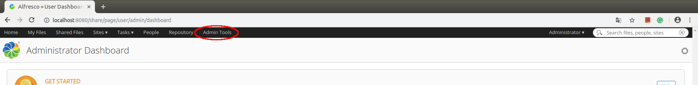
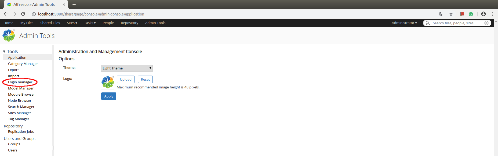
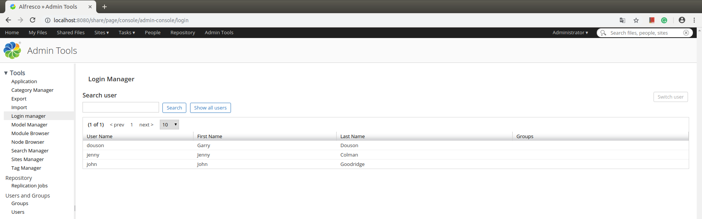
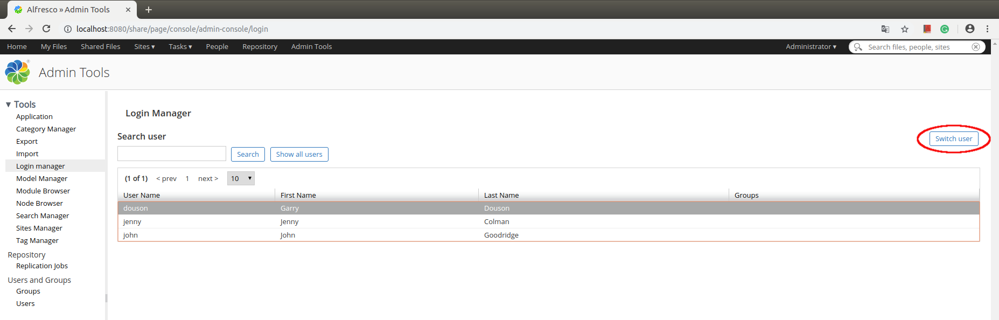
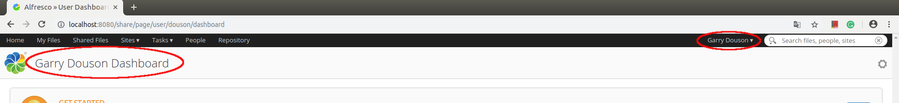

# User Switcher plugin. Includes both: repo and share development in SDK 3
# **Description**
Additional page on administration tools page. Allows user with admin permissions login under another account registered in alfresco without knowing his/her password. Admin sees table with all user logins. He can select user login and click on Switch User action button. After this action, admin will be redirected to user home page. Security context will be replaced with chosen user. 

## Installation
1. Build 2 jars using maven build files under repo-login-switcher and share-login-switcher:
 - open terminal in ./repo-login-switcher and run the command
  
```bash
mvn clean package
```
 - open terminal in ./share-login-switcher and run the command

```bash
mvn clean package
```

2. Copy files from target folders:
 - Copy _repo-login-switcher-1.5.jar_ into _{alfresco_installation_folder}/tomcat/webapps/alfresco/WEB-INF/lib_
 - Copy _share-login-switcher-1.5.jar_ into _{alfresco_installation_folder}/tomcat/webapps/share/WEB-INF/lib_

Start alfresco

## How to use plugin in SDK 4

   In order to use the _**User Switcher plugin**_ in SDK 4 you need to place the plugin's jar files in Tomcat directory into the docker image. JAR extensions are copied directly into the exploded webapp. To do this, follow these steps.

 1. Clone source files.
 2. Open terminal in _user-switcher_ package and run the command: 

```bash
mvn package
```

 3. Create in package _your-alfresco-SDK4/your-alfresco-platform-docker/_ package _jars_.
 4. Create in package _your-alfresco-SDK4/your-alfresco-share-docker/_ package _jars_.
 5. Copy _repo-login-switcher-1.5.jar_ from _user-switcher/repo-login-switcher/target/_  to   _your-alfresco-SDK4/your-alfresco-platform-docker/jars_.
 6. Copy _share-login-switcher-1.5.jar_ from _user-switcher/share-login-switcher/target/_  to _your-alfresco-SDK4/your-alfresco-share-docker/jars_.
 7. Open in editor _your-alfresco-SDK4/your-alfresco-platform-docker/pom.xml_ and add new _execution_ :

```xml
<execution>
  <id>copy-jar</id>
  <phase>package</phase>
  <goals>
     <goal>copy-resources</goal>
  </goals>
  <configuration>
    <outputDirectory>${project.build.directory}/extensions</outputDirectory>
       <resources>
          <resource>
             <filtering>false</filtering>
               <directory>jars</directory>
          </resource>
       </resources>
   </configuration>
 </execution>
```

in:

```xml
<build>
 <plugins>
   <plugin>
      <groupId>org.apache.maven.plugins</groupId> 
      <artifactId>maven-dependency-plugin</artifactId>
      <version>3.0.2</version>
      <executions>
      ...
      <executions>
   </plugin>
 </plugins>
</build>
```
 8. Do the same for _your-alfresco-SDK4/your-alfresco-share-docker/pom.xml_.
 9. And now in _your-alfresco-SDK4/_ open terminal and run the command:

```bash
./run.sh build_start
```
## Work with plugin

 - Login in Alfresco with admin permissions and choose **Admin Tools**:
 
 
 
 - Select **Login manager**:
 
 
 
 - Users will be shown in the table:
 
  
 
 - Choose user and push **Switch user**:
 
 
 
 - You are login under another account:
 
 
 
## How to use plugin with Alfresco Content Service Enterprise
 
 * Open the directory in which you downloaded docker-compose.yml file and create two packages repo and share.
 * Copy _repo-login-switcher-1.5.jar_ to _your-alfresco-enterprise/repo_.
 * Copy _share-login-switcher-1.5.jar_ to _your-alfresco-enterprise/share_.
 * Create Dockerfile in _your-alfresco-enterprise/repo_:
 
```
FROM alfresco/alfresco-content-repository:6.1.0

ARG TOMCAT_DIR=/usr/local/tomcat

COPY *.jar $TOMCAT_DIR/webapps/alfresco/WEB-INF/lib/

``` 

 * Create Dockerfile in _your-alfresco-enterprise/share_:
 
```
FROM alfresco/alfresco-share:6.1.0

ARG TOMCAT_DIR=/usr/local/tomcat

COPY *.jar $TOMCAT_DIR/webapps/share/WEB-INF/lib/

```

 * In docker-compose.yml replace:
 
```
 alfresco:
         image: alfresco/alfresco-content-repository:6.1.0
```

 with:
 
```         
 alfresco:
         build: ./repo
``` 

and

```
 share:
         image: alfresco/alfresco-share:6.1.0
```
 
 with:
 
```
 share:
         build: ./share
```
 
 * Run Alfresco:
 
```bash
 docker-compose up
```
 
 ## License
This project is licensed under the [Apache 2.0](https://choosealicense.com/licenses/apache-2.0/) License - see the LICENSE file for details.